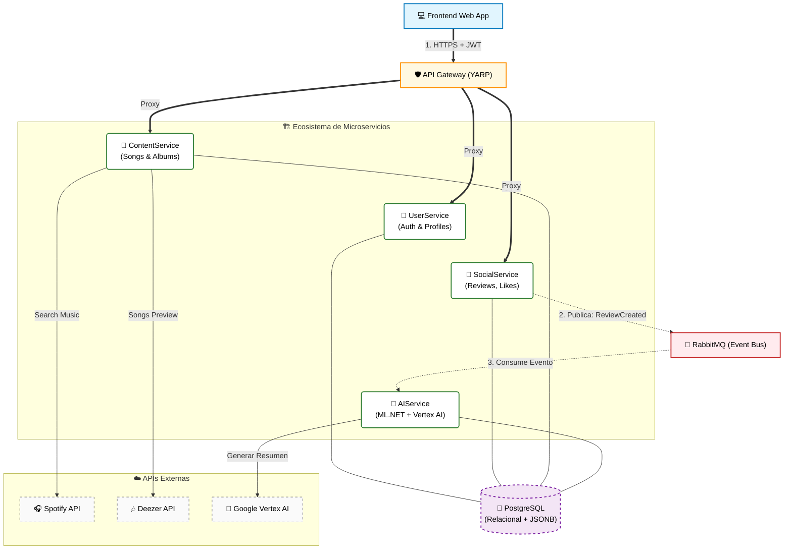

  

  <h1>SoundList 🎧</h1>
  <h3>Distributed Social Music Platform powered by AI</h3>

  

    <b>Microservicios • Event-Driven Architecture • Artificial Intelligence</b>
  

  

    
    
  

---

## 💡 Sobre el Proyecto

**SoundList** no es solo una app de música; es una red social distribuida diseñada para melómanos. Permite a los usuarios reseñar canciones, crear listas colaborativas y recibir análisis de sentimientos generados por IA sobre sus opiniones.

El desafío principal no fue solo consumir la API de Spotify, sino orquestar un ecosistema de **Microservicios en .NET 8** capaz de manejar tareas pesadas (como el procesamiento de IA) sin bloquear la experiencia del usuario, utilizando un enfoque asíncrono con **RabbitMQ**.

### 🌟 Features Clave
* **Integración Musical:** Búsqueda y previsualización en tiempo real vía **Spotify & Deezer APIs**.
* **AI-Powered Insights:** Análisis de reseñas y generación de resúmenes utilizando **Google Vertex AI**.
* **Arquitectura Resiliente:** Comunicación asíncrona para evitar cuellos de botella.
* **Gateway Unificado:** Implementación de **YARP** (Yet Another Reverse Proxy) para enrutamiento seguro.

---

## 🏗️ Arquitectura del Sistema

Como **Tech Lead** del proyecto, diseñé esta arquitectura para asegurar el desacoplamiento de servicios y la escalabilidad.

## 🛠️ Stack Tecnológico

 
   
   
   
   
   
   

