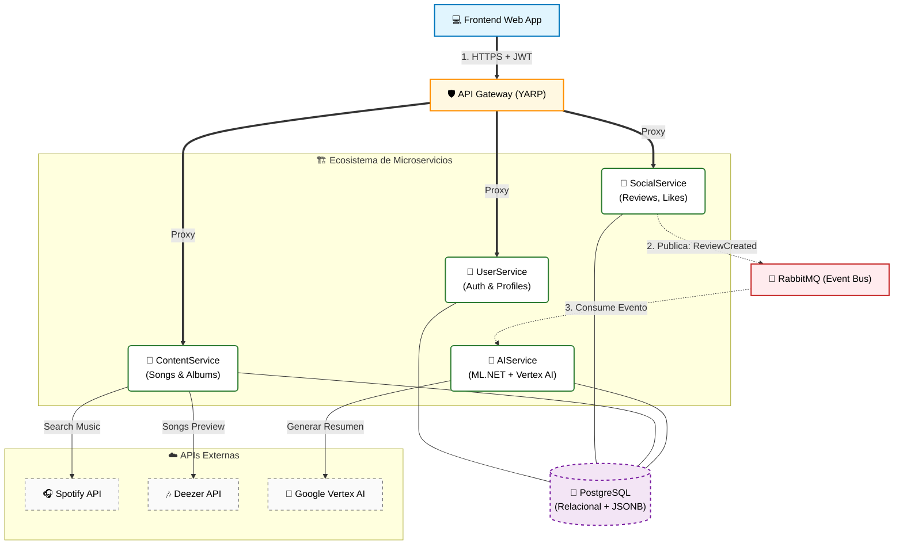

## 🏗️ Arquitectura del Sistema

Aquí se detalla el flujo de comunicación entre Microservicios, Gateway e IA.

```mermaid
graph TD
    %% --- ESTILOS DE ALTO CONTRASTE ---
    %% Usamos fondos claros con bordes fuertes y TEXTO NEGRO para máxima legibilidad
    classDef frontend fill:#E1F5FE,stroke:#0277BD,stroke-width:2px,color:#000000;
    classDef gateway fill:#FFF8E1,stroke:#FF8F00,stroke-width:2px,color:#000000;
    classDef service fill:#FFFFFF,stroke:#2E7D32,stroke-width:2px,color:#000000,rx:5,ry:5;
    classDef db fill:#F3E5F5,stroke:#7B1FA2,stroke-width:2px,stroke-dasharray: 5 5,color:#000000;
    classDef queue fill:#FFEBEE,stroke:#C62828,stroke-width:2px,color:#000000;
    classDef external fill:#FAFAFA,stroke:#616161,stroke-width:1px,stroke-dasharray: 5 5,color:#000000;

    %% --- NODOS PRINCIPALES ---
    Client["💻 Frontend Web App"]:::frontend
    YARP["🛡️ API Gateway (YARP)"]:::gateway
    Rabbit["🐰 RabbitMQ (Event Bus)"]:::queue
    DB[("🐘 PostgreSQL\n(Relacional + JSONB)")]:::db

    %% --- CONTEXTO DE MICROSERVICIOS ---
    subgraph Services ["🏗️ Ecosistema de Microservicios"]
        direction TB
        %% Definimos los nodos con texto negro explícito
        UserS["👤 UserService\n(Auth & Profiles)"]:::service
        SocialS["💬 SocialService\n(Reviews, Likes)"]:::service
        ContentS["🎵 ContentService\n(Songs & Albums)"]:::service
        AIS["🤖 AIService\n(ML.NET + Vertex AI)"]:::service
    end

    %% --- CONTEXTO DE NUBE ---
    subgraph Cloud ["☁️ APIs Externas"]
        Spotify["🎧 Spotify API"]:::external
        Deezer["🎶 Deezer API"]:::external
        Vertex["🧠 Google Vertex AI"]:::external
    end

    %% --- CONEXIONES (FLUJO) ---
    
    %% 1. Entrada
    Client ==>|"1. HTTPS + JWT"| YARP
    YARP ==>|"Proxy"| UserS
    YARP ==>|"Proxy"| SocialS
    YARP ==>|"Proxy"| ContentS

    %% 2. Dependencias Externas
    ContentS -->|"Search Music"| Spotify
    ContentS -->|"Songs Preview"| Deezer
    AIS -->|"Generar Resumen"| Vertex

    %% 3. Comunicación Asíncrona (RabbitMQ)
    SocialS -.->|"2. Publica: ReviewCreated"| Rabbit
    Rabbit -.->|"3. Consume Evento"| AIS

    %% 4. Base de Datos (Conexiones más finas para no ensuciar)
    UserS --- DB
    SocialS --- DB
    ContentS --- DB
    AIS --- DB

    %% Truco visual para alinear (Links invisibles)
    UserS ~~~ AIS
```
