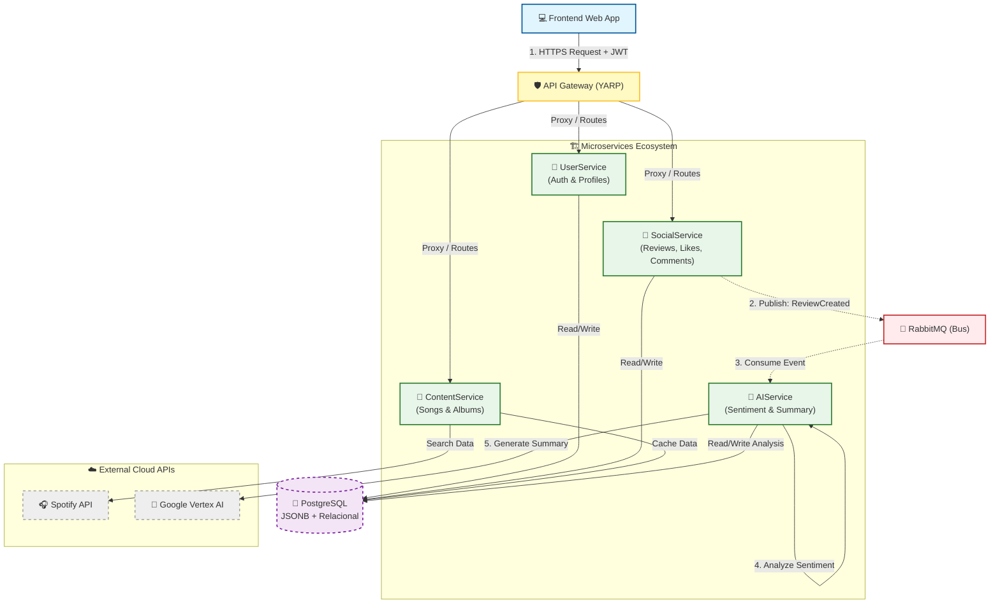

## 🏗️ Arquitectura del Sistema

Aquí se detalla el flujo de comunicación entre Microservicios, Gateway e IA.

```mermaid
graph TD
    %% Estilos
    classDef frontend fill:#e1f5fe,stroke:#01579b,stroke-width:2px;
    classDef gateway fill:#fff9c4,stroke:#fbc02d,stroke-width:2px;
    classDef service fill:#e8f5e9,stroke:#2e7d32,stroke-width:2px;
    classDef db fill:#f3e5f5,stroke:#7b1fa2,stroke-width:2px,stroke-dasharray: 5 5;
    classDef queue fill:#ffebee,stroke:#c62828,stroke-width:2px;
    classDef external fill:#eeeeee,stroke:#616161,stroke-width:1px,stroke-dasharray: 5 5;

    %% Nodos Principales (CON COMILLAS AGREGADAS)
    Client["💻 Frontend Web App"]:::frontend
    YARP["🛡️ API Gateway (YARP)"]:::gateway
    Rabbit["🐰 RabbitMQ (Bus)"]:::queue
    DB[("🐘 PostgreSQL\nJSONB + Relacional")]:::db

    %% Subgrafo de Microservicios
    subgraph Cluster_Services ["🏗️ Microservices Ecosystem"]
        direction TB
        UserS["👤 UserService\n(Auth & Profiles)"]:::service
        SocialS["💬 SocialService\n(Reviews, Likes, Comments)"]:::service
        ContentS["🎵 ContentService\n(Songs & Albums)"]:::service
        AIS["🤖 AIService\n(Sentiment & Summary)"]:::service
    end

    %% Subgrafo Externo
    subgraph Cluster_Cloud ["☁️ External Cloud APIs"]
        Spotify["🎧 Spotify API"]:::external
        Vertex["🧠 Google Vertex AI"]:::external
    end

    %% Conexiones Síncronas (HTTP)
    Client -->|"1. HTTPS Request + JWT"| YARP
    YARP -->|"Proxy / Routes"| UserS
    YARP -->|"Proxy / Routes"| SocialS
    YARP -->|"Proxy / Routes"| ContentS

    ContentS -->|"Search Data"| Spotify

    %% Conexiones a Base de Datos
    UserS -->|"Read/Write"| DB
    SocialS -->|"Read/Write"| DB
    ContentS -->|"Cache Data"| DB
    AIS -->|"Read/Write Analysis"| DB

    %% Conexiones Asíncronas (Mensajería)
    SocialS -.->|"2. Publish: ReviewCreated"| Rabbit
    Rabbit -.->|"3. Consume Event"| AIS

    %% IA Flow
    AIS -->|"4. Analyze Sentiment"| AIS
    AIS -->|"5. Generate Summary"| Vertex

    %% Leyenda (Invisible link for layout)
    UserS ~~~ SocialS
```
